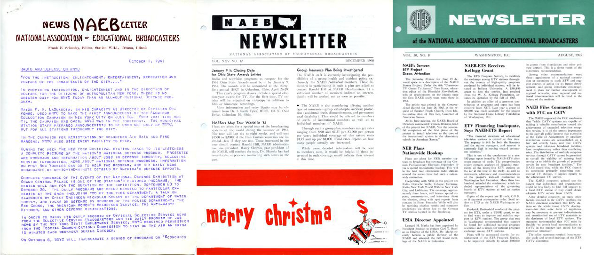
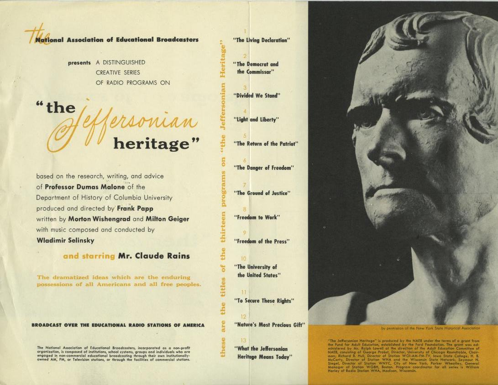

## Project Introduction

**Unlocking the Airwaves: Revitalizing an Early Public and Educational Radio Collection** is a comprehensive online collection of early educational public radio content from the National Association of Educational Broadcasters (NAEB). [The forerunner of CPB and its arms, NPR and PBS](https://mith.umd.edu/airwaves/exhibits/origins-of-the-naeb-and-educational-media/), the NAEB developed and distributed educational radio programs and accompanying print materials to schools and communities across the United States. What’s more, the NAEB lobbied extensively to unlock the airwaves—to access precious frequency space—in order to bring the voices of [poet Robert Frost](https://mith.umd.edu/airwaves/exhibits/poetry-programming-in-the-naeb-collection/), [architect Frank Lloyd Wright](https://mith.umd.edu/airwaves/episode/cpb-aacip-500-dn3zx76f), [anthropologist Margaret Mead](https://mith.umd.edu/airwaves/episode/cpb-aacip-500-hx15rn7k), and conservationist “Ranger Mac,” among many other individuals, into American homes and classrooms.

The NAEB’s collections have much to tell us about 20th century American culture, as well as today’s environment of online educational technology and podcasting. Despite its historic importance and contemporary relevance, however, most of the NAEB members’ programs were never heard again after their initial brief moments on the air. The archives for the radio programs and their related paper documentation have been split for over 25 years between two institutions: the [University of Maryland](https://www.lib.umd.edu/univarchives/about-us) and the [Wisconsin Historical Society](https://www.wisconsinhistory.org).

Unlocking the Airwaves reunites the split collections, finally realizing the potential of the collections of the NAEB for exploration, research, and reflection. We anticipate the resource will prove useful to a wide range of users (including teachers, scholars, journalists, and genealogists) interested in an even wider range of subjects ([African American history](https://mith.umd.edu/airwaves/search/?f=subject:African%20American%20History), [Women's history](https://mith.umd.edu/airwaves/search/?f=subject:Women%27s%20History), the Cold War, [environmental conservation](https://mith.umd.edu/airwaves/search/?f=subject:Ecology%20&%20the%20Environment), and [poetry](https://mith.umd.edu/airwaves/exhibits/poetry-programming-in-the-naeb-collection/), to name just a few). But no matter what topic interests you, it is helpful to know some background information about the NAEB.

## The National Association of Educational Broadcasters (NAEB)

The NAEB’s institutional hands touched every item in this collection—in some cases as a creator, in others as a distributor, and sometimes merely filing away something of interest that arrived in the mail. Understanding the NAEB as an organization provides a richer context for interpreting the documents and recordings accessible through this website.

[The NAEB began in 1925 as the Association of College and University Broadcasting Stations](https://mith.umd.edu/airwaves/exhibits/origins-of-the-naeb-and-educational-media/). From its inception until its dissolution in 1981, the faculty and staff at large public Midwestern universities [played key leadership roles within the organization](https://mith.umd.edu/airwaves/exhibits/the-organizational-structure-of-the-naeb/). The story of the NAEB is, therefore, the intertwined stories of broadcasting initiatives at the University of Wisconsin, University of Illinois, University of Minnesota, and the Ohio State University, to name just a few of the most active and prominent players. It is perhaps fitting that media archivists and scholars at two Big 10 universities are at the helm of Unlocking the Airwaves.

The professors and university staff members who devoted themselves to the NAEB were idealists, believing in the utopian possibilities of technology for education and social uplift. Radio held the potential to bring dynamic voices into the classroom, as well as educate adults who never had the opportunity to attend college—or, in many cases, finish high school. The NAEB’s leaders faced considerable challenges in the pursuit of these goals, including economic depression, world war, and the scarcity of the electromagnetic spectrum.

The NAEB Newsletter (pictured below, in three of its typographic iterations) provides a window into the organization’s efforts and priorities. During the 1930s, advocacy efforts to the FCC took center stage; the NAEB lobbied the government for bigger and better frequency allocations for educational stations. While advocacy efforts did not go away during the 1940s, it did become subordinated to the war effort and the coordinated distribution of recorded programs.

The NAEB’s most productive period as a creator of programs occurred during the 1950s, with its work on ambitious series such as [People Under Communism](https://mith.umd.edu/airwaves/programs/people-under-communism) and [The Jeffersonian Heritage](https://mith.umd.edu/airwaves/programs/the-jeffersonian-heritage) (featuring character actor Claude Rains in the role of Thomas Jefferson). In the late-1950s, the NAEB sponsored the [innovative research study, “Project in Understanding New Media,” led by media theorist Marshal McLuhan](https://mith.umd.edu/airwaves/exhibits/marshall-mcluhan-and-the-understanding-media-project/). The organization also devoted considerable resources toward the development of educational television.

Although the NAEB continued to exist until the early-1980s, the organization’s vitality gradually diminished across the 1960s and 70s. In some ways, the NAEB was a victim of its own success: the decades of federal lobbying contributed to the creation of CBP, PBS, and NPR. Additionally, the NAEB had a challenging time adapting to the shift from “educational media” to “public media”—a new landscape in which conversational broadcasting styles were preferred over on-air lectures. In the new environment of public media, large-market stations (e.g. [WNYC](https://mith.umd.edu/airwaves/search/?q=WNYC), [WGBH](https://mith.umd.edu/airwaves/search/?q=WGBH), [KQED](https://mith.umd.edu/airwaves/search/?q=KQED)) wielded far more power than the university stations that had led the NAEB (e.g. [Madison’s WHA](https://mith.umd.edu/airwaves/search/?q=WHA) and [Columbus’s WOSU](https://mith.umd.edu/airwaves/search/?q=WOSU)).

Yet if the NAEB is today forgotten as an organization, the legacy of its initiatives, ideas, and actions are still widely felt. Anytime a listener downloads the TED Radio Hour podcast to their iPhone, or turns on the car radio and hears Terry Gross interviewing an author on Fresh Air, that listener is participating in a 100-year-old tradition of utilizing audio broadcasting to educate and inform the American public. And while it would take internet networks to provide an infrastructure for MOOCs (Massive Open Online Courses), the concept was championed by radio enthusiasts at Midwestern universities in the 1920s and 30s.

The NAEB made history—and preserved its own history, too. Newly digitized and reunited, the NAEB’s collection of recordings, publications, and manuscripts provide essential sources for the study of American broadcasting, society, and culture.

## Technological Infrastructure

Unlocking the Airwaves employs a minimal computing application design, which combines static site generation, client-side web framework and indexing technologies to minimize server side dependencies, and greatly reduce the cost of deployment and long-term maintenance. The application design uses [Airtable](https://airtable.com) for distributed data curation, and the [Internet Archive](https://archive.org) as a data publishing platform. These approaches allow us to examine facets of digital collection building and maintenance that have been explored with “standard” online platforms and software, but which have not been investigated in minimal computing frameworks.

The application website itself is being generated as a static site using [Gatsby](https://www.gatsbyjs.com), an open source framework based on [React](https://reactjs.org), in conjunction with [Elasticlunr](http://elasticlunr.com), which indexes the JSON files generated out of a) the Internet Archive (text from OCR derivatives of the scanned images) and b) Airtable (Dublin Core metadata about digitized folders, PBCore metadata about audio, and metadata for Authorities and Series titles).

The digitized images of the paper collections are being redundantly stored on a RAID drive at the [University of Wisconsin-Madison’s CommArts Instructional Media Center](https://commarts.wisc.edu), as well as on Internet Archive servers. MITH Developer [Ed Summers](https://archive.mith.umd.edu/mith-2020/index.html%3Fp=13276.html) developed a custom uploader program that utilizes the Airtable API to automatically take a folder of individual digitized images from a given folder, bundle them into one package, upload them to the NAEB collection on the Internet Archive, and map the metadata from Airtable into the Internet Archive’s metadata schema.

Since the Internet Archive offers integration with the [International Image Interoperability Framework (IIIF)](https://iiif.io), the project team made the decision to use the IA as part of our digitization workflow, not only for redundant storage/access points and creating derivatives for all scanned materials, but also so we could utilize the [Mirador image viewer](https://projectmirador.org). Mirador supports the IIIF standard, and the new version is written in React, which dovetails nicely with Gatsby.

Transcripts of the audio files are currently being stored as [WebVTT](https://www.w3.org/TR/webvtt1/) files in an Amazon Web Services S3 bucket, which feeds into the application and merges the audio and transcripts for display in a WebVTT player designed by Summers.
